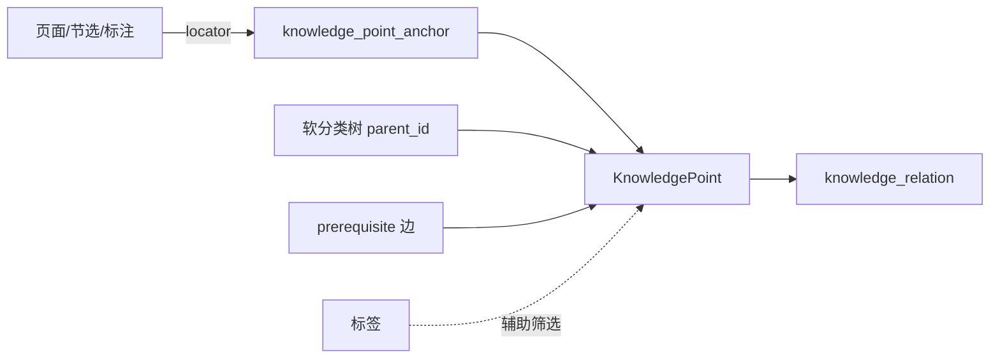

# 知识关联（Knowledge Relations）— Phase 1.5

> 状态：**已实施（Phase 1.5）**
> 关联：[tu-frontend-ui SKILL §6](../../.cursor/skills/tu-frontend-ui/SKILL.md)、[tree-structure-management.md](./tree-structure-management.md)

## 1. 目标

跨页面、节选、标注等位置建立**可扩展语义关系**（如「案例」「依据」「前置」），支持双向反查与跳转。关系端点为**知识点（KnowledgePoint）**；页面/节选/标注作为**证据（evidence）**绑定到知识点，可随编辑迁移。

Phase 1.5：**知识点中间层 + 建链 + 定位 + 分页列表**；图谱投影与学习路线见 Phase 2/3。

## 2. 三层架构

| 层 | 职责 | 是否进入 `knowledge_relation` |
|----|------|--------------------------------|
| **结构层** | 页面目录、资源章节、TOC 大纲 | 否 |
| **语义层** | 知识点身份、前置/案例/依据 | **是（端点为知识点 ID）** |
| **证据层** | 「这段话/这页在讲哪个点」 | 否（`knowledge_point_anchor`） |

- **软分类树**（`knowledge_point.parent_id`）仅分组浏览，**不**隐含前置关系
- **前置**只用 `prerequisite` 有向边；标签横切筛选，不驱动学习路线

## 3. 锚点 locator 约定（证据层）

| `anchorKind` | locator 格式 | 示例 |
|--------------|-------------|------|
| `page` | `page:{pageId}` | `page:abc` |
| `heading` | `page:{pageId}:heading:{blockId}` | `page:abc:heading:h1` |
| `section` | `page:{pageId}:section:{sectionKey}` | `page:abc:section:local:blk` |
| `annotation` | `page:{pageId}:annotation:{id}` | `page:abc:annotation:ann1` |
| `resourceItem` | `resource:{itemId}` | |
| `resourceExcerpt` | `resource:{itemId}:excerpt:{excerptId}` | |
| `block` | `page:{pageId}:block:{blockId}` | 文档内嵌入块（画板、表格、PDF 等） |
| `block`（PDF 页） | `page:{pageId}:block:{blockId}:pdfPage:{n}` | 跳转到 PDF 摘页块内第 n 页 |

`snapshot` JSON 存展示用标题等；跳转以 locator 为准。反查路径：`by-anchor` → 找到关联知识点 → `by-point` 展示点间关系。

## 4. 关系类型注册表

- 系统预置（`kbId = null`）：`source`、`basis`、`case`、`cites`、`related`、`prerequisite`
- 知识库可 `POST /api/kbs/{kbId}/relation-types` 扩展自定义类型
- `related` 为双向；其余默认有向（fromPoint → toPoint）

## 5. 与树 / 标注 / 标签 / 页面的边界

| 概念 | 用途 | 存储 |
|------|------|------|
| **标签** | 分类、筛选 | 页面/块/节 metadata；知识点 `metadata_json` 辅助 chips |
| **知识点软分类树** | 概念分组浏览 | `knowledge_point.parent_id`（与 `PageItem` 无 FK） |
| **关系** | 语义边（案例、依据、前置…） | `knowledge_relation.from_point_id` / `to_point_id` |
| **证据** | 位置绑定 | `knowledge_point_anchor` |
| **页面树** | 目录、导航 | `PageItem.parentId`；建链默认**不**以页面树为关系目标 |

知识关联边**不进入**页面父子树（同 `ResourceItemRelation`）；Phase 2 可投影到 X6 图谱。

## 6. 迁移与双写

| 现有能力 | 编辑真源 | 索引投影 |
|---------|---------|---------|
| `headingSource` | Tiptap heading attrs | 知识点 + `source` 边 + 证据 |
| `basis` 标注 | `TextAnnotation.basisBinding` | 知识点 + `basis` 边 + 证据 |
| Phase 1 anchor 关系 | — | 启动迁移：为 anchor 创建知识点并投影 point 边 |
| 用户建链 UI | — | `provenance=user` |

`saveContent` 后 rebuild 本页 migrated 关系；用户创建的关系不删除。

## 7. API

### 知识点

| 方法 | 路径 |
|------|------|
| GET | `/api/kbs/{kbId}/knowledge-points/tree` |
| GET | `/api/kbs/{kbId}/knowledge-points`（分页，`pageSize` 默认 10） |
| GET | `/api/kbs/{kbId}/knowledge-points/by-locator?locator=…` |
| POST | `/api/kbs/{kbId}/knowledge-points` |
| PATCH/DELETE | `/api/knowledge-points/{id}` |
| GET/POST/DELETE | `/api/knowledge-points/{id}/anchors` |
| GET/POST | `/api/knowledge-points/{id}/aliases` |
| DELETE | `/api/knowledge-point-aliases/{aliasId}` |
| POST | `/api/kbs/{kbId}/knowledge-points/generate`（body: `sources`: `pageTree` / `documentHeadings`，可选 `pageIds`） |

`generate` 仅创建知识点 + `primary` 证据锚点，不创建 `knowledge_relation`、不设置 `parent_id`（扁平生成）。同 locator 已绑定则跳过（幂等）。

### 关系

| 方法 | 路径 |
|------|------|
| GET | `/api/kbs/{kbId}/relation-types` |
| POST | `/api/kbs/{kbId}/relation-types` |
| GET | `/api/kbs/{kbId}/relations`（分页；支持 `pointId` 筛选） |
| POST | `/api/kbs/{kbId}/relations`（body: `fromPointId`, `toPointId`, `typeKey`） |
| GET | `/api/knowledge-points/{pointId}/relations?kbId=…` |
| GET | `/api/kbs/{kbId}/relations/by-anchor?locator=…`（桥接：证据 → 知识点 → 关系） |
| DELETE | `/api/relations/{id}` |

## 8. UI 约定

- 创建：`SelectionToolbar` →「建立关联」→ 弹窗「关联到知识点」：单选要挂靠的知识点；编辑器带入的可定位内容静默写入 `relation.from`，**不展示**证据栏、不做知识点↔知识点双选
- 知识点建立（含为内容绑定知识点）：资源管理「知识点」Tab、从结构生成、`createKnowledgePoint + sourceAnchor`；**不在**关联弹窗内提供
- 目标知识点可在 Picker 知识点树内直接新建：工具栏 `+` 创建顶层知识点，节点右键「添加子知识点」创建子级；新建知识点不自动绑定当前证据（独立于内容的标签式实体）
- 知识点树支持重命名：节点右键「重命名」，或选中节点后按 `F2`（管理面板与关联弹窗共用 `KnowledgePointTree`）
- 管理：资源管理「知识点」Tab（[`KnowledgePointTree.vue`](../src/components/knowledge/KnowledgePointTree.vue) 分类树为主：拖拽调层级、右键新建/重命名/删除；右侧详情展示证据/别名/关联）
- **从结构生成**：知识点 Tab 工具栏「从结构生成…」→ 勾选知识库页面树 / 文档标题结构；若工作区有当前页则仅处理该页。完成后刷新分类树
- **别名**：选中知识点后在详情区维护别名 chips；列表搜索与 Picker 搜索 Tab 可命中别名（副标题展示匹配别名）
- 查看：`NotePopover`、标题来源徽章、资源管理「知识关联」Tab
- 跳转：`navigateKnowledgePoint(pointId)` → 取 `is_primary` 证据 → `navigateKnowledgeAnchor(locator)`

## 9. Phase 2/3（未实施）

- **Phase 2**：知识点 + 关系 → X6 知识图谱
- **Phase 3**：`prerequisite` 子图 + `estimated_hours` 学习路线与门禁
