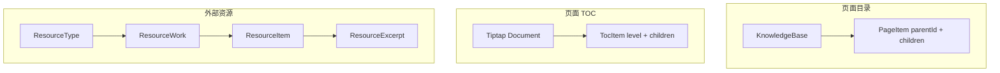

# 树形结构管理 — 设计方案

> 状态：**P0–P1 已实施**（2026-06）；P2/P3 适配器已落地，TOC UI 替换待 v2
> 关联讨论：页面目录、页面 TOC、外部资源（类型 → 归类 → 实体 → 节选）等层级结构的统一展示与序列化。

---

## 1. 背景与目标

项目中存在多种「看起来像树」的结构，但实现分散、遍历逻辑重复。本方案旨在抽取**与业务无关**的树形能力，而非用一棵树替代所有领域模型。

### 1.1 目标（v1）

| 能力 | 说明 |
|------|------|
| **展示** | 通用多级列表组件：缩进 + 展开/收起 + 选中，初版不替代页面 `el-tree` 的拖拽 |
| **结构输出** | 统一的 `TreeNode` 嵌套 JSON、带路径的扁平列表、Markdown 大纲等 |

### 1.2 非目标（v1 不做）

- 统一的树形持久化 API 或单表存储
- 跨域（页面 / 资源 / TOC）的拖拽、合并、删除规则
- 将 `ResourceItemRelation`（图关系）并入父子树
- AI 自动建树、多用户树共识
- **知识关联边**（`knowledge_relation`）不进入父子树；与 `ResourceItemRelation` 同层，见 [knowledge-relations.md](./knowledge-relations.md)，Phase 2 投影到 X6 图谱
- **知识点软分类树**（`knowledge_point.parent_id`）与 `PageItem` 页面目录**并列**，非子集；页面/节选仅作证据 locator，见 [knowledge-relations.md](./knowledge-relations.md) §2

---

## 2. 现状盘点

### 2.1 知识库 → 页面目录

| 项 | 内容 |
|----|------|
| 模型 | [`PageItem`](../src/api/types.ts)：`parentId`、`order`、嵌套 `children?` |
| 持久化 | 后端邻接表，`PageService` 组树；API `GET /api/kbs/{kbId}/pages/tree` |
| UI | [`LeftPanel.vue`](../src/components/LeftPanel.vue) — `el-tree`，拖拽、右键、重命名 |
| 特点 | **标准可变树**，实现最成熟 |

### 2.1.1 知识点软分类树

| 项 | 内容 |
|----|------|
| 模型 | [`KnowledgePoint`](../src/api/types.ts)：`parentId`、`sortOrder`、嵌套 `children?` |
| 持久化 | `KnowledgePointService.buildTree`；`PATCH /api/knowledge-points/{id}` 支持 reparent + 兄弟重排 |
| UI | [`KnowledgePointTree.vue`](../src/components/knowledge/KnowledgePointTree.vue) — 与页面目录同为 `el-tree` 可编辑树；用于资源管理「知识点」Tab 与「关联到知识点」弹窗 |
| 特点 | **软分类**（非前置关系）；`TreeListPanel` 只读浏览，**不**用于知识点编辑 |

### 2.2 页面内目录（TOC）

| 项 | 内容 |
|----|------|
| 模型 | [`TuEditorPage.vue`](../src/components/TuEditorPage.vue) 内 `TocItem`：`level`、`children?`、`sourceType` |
| 持久化 | **不存库**；由 Tiptap 文档扫描 + 按 level 组树 |
| UI | 编辑器侧栏多级列表 |
| 特点 | **派生虚拟树**，节点类型异质（标题、引用组、画板等），id 常含文档位置 |

### 2.3 外部资源：类型 → 归类 → 实体 → 节选

| 项 | 内容 |
|----|------|
| 模型 | `ResourceType` → `ResourceWork` → `ResourceItem` → `ResourceExcerpt`（外键链，非 `parentId` 树） |
| 持久化 | 各实体独立 CRUD；`clusterKey` 用于 URL 聚类；`ResourceItemRelation` 为**有向关系边** |
| UI | [`ResourceManagerView.vue`](../src/views/ResourceManagerView.vue) — **分 Tab 平铺表格** |
| 特点 | **固定深度层级**（约 3～4 层），最适合先做「树形浏览」 |

### 2.4 其他（仅参考，v1 不纳入）

- `Block.children`（container 嵌套）
- `RoadmapNode.children`（导入）
- X6 `MindmapTreeNode`（布局算法）

### 2.5 结构关系示意



---

## 3. 设计原则

1. **领域模型不动**：`PageItem`、`ResourceWork` 等保持原样；树层只做适配与展示。
2. **规范节点先行**：对外交换、导出、简单 UI 统一使用 `TreeNode`。
3. **适配器隔离**：各域 `*ToTreeNodes()` 负责把业务数据转成 `TreeNode[]`。
4. **能力分阶段**：工具函数 → 资源树 UI → TOC/导出 → 页面树仅适配不替换 `el-tree`。

---

## 4. 核心类型（规范树）

建议路径：`tu-web-ts/src/utils/tree/types.ts`

```typescript
/** 嵌套树节点（展示 / 导出 / 交换） */
export interface TreeNode<TMeta = unknown> {
  id: string
  label: string
  children?: TreeNode<TMeta>[]
  meta?: TMeta
}

/** 扁平节点（parentId 构建树、表格、搜索） */
export interface FlatTreeNode<TMeta = unknown> {
  id: string
  parentId: string | null
  label: string
  order?: number
  meta?: TMeta
}

/** 可选 v2 扩展字段（meta 或节点级） */
// kind?: string       // 'page' | 'resource-work' | 'toc-heading' ...
// disabled?: boolean
// icon?: string
```

### 4.1 各域 `meta` 约定（草案）

| 域 | `meta` 示例字段 | 用途 |
|----|-----------------|------|
| 页面 | `pageId`, `kbId`, `parentId`, `order` | 导航、导出 |
| TOC | `sourceType`, `level`, `blockId`, `pos` | 跳转、大纲级别 |
| 资源 | `layer`: `'type' \| 'work' \| 'item' \| 'excerpt'`, `entityId`, `typeCode`, `clusterKey?` | 选中后打开对应 Tab/表单 |

---

## 5. 工具层（纯函数，无 UI）

建议路径：`tu-web-ts/src/utils/tree/`

| 模块 | 函数 | 说明 |
|------|------|------|
| `build.ts` | `buildTreeFromFlat(flat)` | `parentId` 列表 → 森林（页面树） |
| `flatten.ts` | `flattenTree(nodes, options?)` | 嵌套 → 扁平，含 `depth`、`pathLabels?` |
| `walk.ts` | `walkTree`, `findTreeNode`, `findTreePath` | 遍历与查找 |
| `levels.ts` | `buildTreeFromLevels(items, getLevel, getId, getLabel)` | TOC 类按 level 压栈组树 |
| `serialize.ts` | 见 §6 | 结构输出 |

**可替换的重复逻辑（实施时收敛）**：

- `workspace.ts` 内 `flattenPages` / `findPageTitle` 的 walk
- `BlockPicker.vue` 内 `flattenPages`
- 资源合并归类等处的列表展示（可选改为树选择）

---

## 6. 结构输出（序列化）

建议路径：`tu-web-ts/src/utils/tree/serialize.ts`

统一流程：**业务数据 → 适配器 → `TreeNode[]` → 选择输出格式**。

| 函数 | 输出 | 典型用途 |
|------|------|----------|
| `toTreeDocument(nodes, options?)` | `{ title?, nodes: TreeNode[] }` | API 交换、AI 上下文、JSON 导出 |
| `toFlatWithPath(nodes)` | `{ id, label, path: string[], depth, meta? }[]` | 表格、全文搜索、调试 |
| `toMarkdownOutline(nodes, getLevel?)` | `string` | TOC/页面大纲复制、文档生成 |

`getLevel` 默认：有 `meta.level` 用之，否则按 `depth + 1`。

---

## 7. 域适配器

建议路径：`tu-web-ts/src/utils/tree/adapters/`

| 文件 | 输入 | 树形态 |
|------|------|--------|
| `pages.ts` | `PageItem[]`（已嵌套或扁平+parentId） | 知识库页面目录 |
| `toc.ts` | `TocItem[]` | 文档大纲 |
| `resources.ts` | `{ types, works, items, excerpts }` 或现有 store 列表 | 类型 → 归类 → 实体 → 节选 |

### 7.1 资源树构建规则（`resourcesToTreeNodes`）

```
ResourceType (根下第一层，或虚拟根「外部资源」)
  └── ResourceWork (同 typeId 过滤)
        └── ResourceItem (workId 匹配；无 work 的 item 可挂「未归类」节点)
              ├── [book] ResourceChapter (parentId 树，前缀 rc:)
              │     └── ResourceExcerpt (chapterId 匹配)
              ├── [book] 「未归类节选」 (chapterId 为空时)
              └── [web-link] ResourceExcerpt (扁平，resourceItemId 匹配)
```

- 节点 `id` 建议加前缀避免冲突：`rt:`, `rw:`, `ri:`, `rc:`, `re:`；未归类节选容器为 `re-unassigned:{itemId}`。
- `label`：实体 `title`；归类可附 `clusterKey` 缩写；章节可附 `locator`。
- 图书章节挂在 **ResourceItem** 级；节选 `chapterId` 可选，未关联时归入「未归类节选」或（无章节时）直接挂在实体下。
- 不在 v1 展示 `ResourceItemRelation` 边（属图结构，可后续用「关系」面板）。

---

## 8. UI 组件（v1：多级列表）

建议路径：`tu-web-ts/src/components/tree/TreeListPanel.vue`

### 8.1 Props / Events

```typescript
// Props
nodes: TreeNode[]
selectedId?: string | null
defaultExpandDepth?: number   // 默认 1 或 2
indentPx?: number             // 默认 16

// Events
select: (node: TreeNode) => void
toggle: (node: TreeNode, expanded: boolean) => void
```

### 8.2 行为

- 递归渲染：每行 `label` + 展开三角（有 children 时）。
- 点击行：`select`；点击三角：展开/收起（不冒泡触发 select 可选）。
- 选中态高亮；`selectedId` 外部受控。

### 8.3 与 `el-tree` 的分工

| 场景 | 组件 |
|------|------|
| 页面目录（拖拽、右键、重命名） | **保留** `LeftPanel` 现有 `el-tree` |
| 知识点软分类（拖拽、右键、重命名） | **`KnowledgePointTree`**（`el-tree`，管理 + 关联弹窗） |
| 资源管理浏览、合并归类目标选择、设置页预览 | **新建** `TreeListPanel` |
| TOC 侧栏 | v2 评估是否替换为 `TreeListPanel`（需保留 scroll-to-pos） |

---

## 9. 集成点（实施后）

### 9.1 资源管理 [`ResourceManagerView.vue`](../src/views/ResourceManagerView.vue)

- 左侧（或 Tab 内）增加「树形浏览」：`resourcesToTreeNodes` + `TreeListPanel`。
- 选中节点：根据 `meta.layer` 切换 Tab 并定位实体（类型 / 归类 / 实体 / 节选）。
- 「合并归类」对话框：列表已改为表格单选；可 **v1.1** 升级为 `TreeListPanel` 按归类分支选择。

### 9.2 页面目录

- **不替换** `el-tree`。
- 可选：`pagesToTreeNodes` + `toMarkdownOutline` / `toFlatWithPath` 用于导出、调试工具。

### 9.3 TOC（页面侧栏目录）

采集逻辑见 [`utils/toc/headings.ts`](../src/utils/toc/headings.ts)，由 [`TuEditorPage.vue`](../src/components/TuEditorPage.vue) 渲染。

**纳入目录：**

- 主文档 Tiptap `heading` 节点（渲染为 `h1`–`h6`）
- 引用块（`refBlock`）外层标题（ResizableBlockWrapper 渲染的 h 标题；`metadata.tocSettings.hideTitle` 时省略外层）
- 引用内容中富文本来源的 ATX 标题（`richtext` 块 `#` …、`externalResource` 节选 `excerptText`；经层级偏移后与 TuEditor 渲染一致）
- 外部资源块（`externalResourceBlock`）：设置了 `headingLevel` 时的外层标题，以及节选正文中 `#` 标题（节选以只读 TuEditor 渲染，目录可精确跳转）；可通过 nodeView 悬浮栏「目录等级」设置外层标题级别

**不纳入：** 画板、表格、时间轴、分割块等非富文本 nodeView；引用页内嵌套 `ref` embed（v1）；nodeView 仅作视觉展示的 `headingLevel` 标题（未作为外层 group 采集时）。

**目录等级设置：** 点击引用块或外部资源块，在悬浮操作栏选择「目录等级」，可设置外层标题为自动 / H1–H6；引用块还可勾选「不在目录显示外层标题」。设置写入 `metadata.tocSettings` 与 `headingLevel` 并持久化。

- v2：`tocToTreeNodes` 复用 `TreeListPanel` 或仅复用 `serialize` 导出大纲。

---

## 10. 实施阶段

| 阶段 | 范围 | 交付物 | 依赖 |
|------|------|--------|------|
| **P0** | 基础设施 | `types.ts`、`buildTreeFromFlat`、`flattenTree`、`walkTree`、`findTreeNode`；单测 | 无 |
| **P1** | 资源域 | `adapters/resources.ts`、`serialize.ts`（`toFlatWithPath` + `toTreeDocument`）；`TreeListPanel.vue`；`ResourceManagerView` 集成树浏览 | P0 |
| **P2** | TOC / 导出 | `adapters/toc.ts`、`toMarkdownOutline`；TOC 或开发工具入口 | P0 |
| **P3** | 页面适配 | `adapters/pages.ts`；与 `flattenPages` 收敛；导出用例 | P0 |
| **P1.1** | 体验 | 合并归类对话框改用树选择；资源树与 Tab 联动 polish | P1 |

**预估体量（仅供参考）**：P0 ~0.5d，P1 ~1.5d，P2 ~0.5d，P3 ~0.5d（不含 E2E）。

---

## 11. 测试建议

| 层级 | 内容 |
|------|------|
| 单元 | `buildTreeFromFlat`（多根、乱序、孤儿节点）、`buildTreeFromLevels`、`flattenTree` 路径、`resourcesToTreeNodes` 固定样例 |
| 组件 | `TreeListPanel` 展开/选中（可选 Playwright 快照） |
| E2E | 资源管理：树中点击实体 → 右侧表单/表格联动（mock 模式即可） |

---

## 12. 风险与缓解

| 风险 | 缓解 |
|------|------|
| 资源四表组树与 Tab 状态不同步 | 选中节点统一走 `onTreeSelect(meta)` 分发 |
| 节点 id 跨类型冲突 | 适配器强制前缀 `rt:/rw:/ri:/re:` |
| TOC id 含 `pos` 不稳定 | TOC 树仅用于展示/导出，不做持久主键 |
| 与 `el-tree` 重复维护 | 页面树继续 `el-tree`；新场景只用 `TreeListPanel` |
| 性能（大列表） | v1 全量渲染；超过 ~500 节点再考虑虚拟滚动 |

---

## 13. 目录结构（实施后）

```text
tu-web-ts/src/
  utils/tree/
    types.ts
    build.ts
    flatten.ts
    walk.ts
    levels.ts
    serialize.ts
    index.ts
    adapters/
      pages.ts
      toc.ts
      resources.ts
  components/tree/
    TreeListPanel.vue
```

---

## 14. 决策记录

| 日期 | 决策 |
|------|------|
| 2026-06 | 采用「规范 `TreeNode` + 适配器 + 简单多级列表」，不合并领域模型 |
| 2026-06 | 页面目录保留 `el-tree`；资源管理优先上树形浏览 |
| 2026-06 | v1 不实现通用树的 CRUD/拖拽；`ResourceItemRelation` 不进入树边 |

---

## 15. 实施记录

| 日期 | 内容 |
|------|------|
| 2026-06 | P0 工具层：`src/utils/tree/` |
| 2026-06 | P1：`TreeListPanel.vue`、`ResourceManagerView` 左侧资源结构树、合并归类树选择 |
| 2026-06 | P2/P3 适配器：`adapters/toc.ts`、`adapters/pages.ts`（导出/复用；页面仍用 `el-tree`） |

## 17. 统一内容树 `content_tree_node`（2026-06）

| 项 | 内容 |
|----|------|
| 表 | `content_tree_node` + `content_tree_scope`；`scope_type=page` 物化页面 outline，`scope_type=resource_item` 替代原 `external_resource_chapter` |
| 工时 | 节点 `estimatedHours` 可编辑；API 返回 `totalEstimatedHours`（后代 rollup，语义同多维表格 `recordTotalHours`） |
| 读 API | `GET /api/pages/{id}/outline`、`GET /api/blocks/{id}/outline`、`POST /api/outlines/batch` |
| 写 API | `PATCH /api/content-tree-nodes/{id}`（工时）；页面 outline 随 `PageIndexCoordinator` 自动 rebuild |
| ES | `tu_headings` 索引 + `GET /api/search/headings` |
| 前端 | [`outlineCache`](../src/stores/outlineCache.ts)、[`mindmapRefToc.ts`](../src/utils/toc/mindmapRefToc.ts) 读 outline API（`structureSource: 'outline'`）；思维导图引用块展开/目录物化**不**拉 `GET /api/pages/{id}/content`，加载时 batch prefetch、展开前 `ensurePageOutline` / `ensureBlockOutline` |
| 思维导图目录投影 | 首次展开引用块时物化子树；折叠/再展开仅切换可见性，**不** reconcile。图增删改不再触发 outline 对齐。选中引用块 → 属性面板「从目录同步」可显式 reconcile；拖拽/删除子节点会持久化，直至用户主动同步 |
| Mock | [`mock/contentTree.ts`](../src/mock/contentTree.ts) + `contentTreeHours` in [`mock/store.ts`](../src/mock/store.ts) |

## 16. 确认后下一步

1. 评审本方案（尤其是资源树层级与 `meta` 约定）。
2. 按 P0 → P1 顺序实施；每阶段至少 `npm run type-check`，P1 起补充 Playwright（若涉及 UI 交互）。
3. 实施完成后在本文档顶部将状态改为「已实施」，并补充实际路径与 API 链接。
